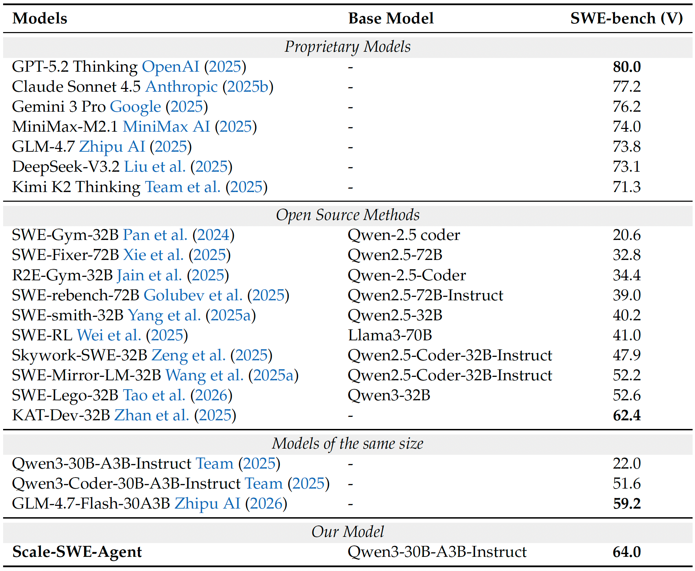

# Immersion in the GitHub Universe: Scaling Coding Agents to Mastery

<div align="center">

[](https://arxiv.org/abs/2602.09892)
[](https://huggingface.co/collections/AweAI-Team/scale-swe)
[](https://huggingface.co/Awe-AI/Scale-SWE)
[](https://aweai-team.github.io/projects/scaleswe/)
[](LICENSE)
<br>


</div>


## 🔥 Highlights

- Source from 6M+ pull requests and 23000+ repositories.
- Cover 5200 Repositories.
- 100k high-quality instances.
- 71k trajectories from DeepSeek v3.2 with 3.5B token.
- Strong performance: 64% in SWE-bench-Verified trained from Qwen3-30A3B-Instruct.

## 📣 News
- **2026-02-26** 🚀 We released a portion of our data on [Hugging Face](https://huggingface.co/collections/AweAI-Team/scale-swe). This release includes **20,000 SWE task instances**—currently the largest **Real Executable** open-source SWE dataset available—alongside **71k distillation trajectories(3.5B)** from DeepSeek v3.2. **Much more data** will be released in the future.
- **2026-02-10** 📝 Our paper [**"Immersion in the GitHub Universe: Scaling Coding Agents to Mastery"**](https://arxiv.org/abs/2602.09892) is now available on arXiv.

## 📊 Data Format


| Field | Description |
| :--- | :--- |
| **`instance_id`** | A unique identifier formatted as `{user}_{repo}_pr{id}`. |
| **`user`** | The owner of the GitHub repository. |
| **`repo`** | The name of the GitHub repository. |
| **`language`** | The programming language of the codebase (currently Python). |
| **`workdir`** | The working directory path within the environment. |
| **`image_url`** | The URL of the pre-built Docker image for the task. |
| **`patch`** | The ground-truth patch (**Golden Patch**) from the corresponding pull request. |
| **`pr_commit`** | The commit hash of the pull request. |
| **`parent_commit`** | The commit hash of the parent commit (base state). |
| **`problem_statement`** | The issue description conveying the bug, provided to the model as input. |
| **`f2p_patch`** | The developer-written test patch containing tests that fail before the fix (if available). |
| **`f2p_script`** | The synthetic reproduction script generated by our unit-test creator agent. |
| **`FAIL_TO_PASS`** | Unit tests that fail on the buggy version but pass after the fix. |
| **`PASS_TO_PASS`** | Unit tests that pass in both versions (regression tests). |
| **`github_url`** | The URL of the original GitHub repository. |
| **`pre_commands`** | These commands must be executed immediately upon entering the container to check out the correct commit. |

## 🤖 Results
We fine-tuned Qwen-30B-A3B-Instruct on our synthesized trajectories.


## 📖 Citation

If you find this project useful for your research, please consider citing our paper:
```
@misc{zhao2026immersiongithubuniversescaling,
      title={Immersion in the GitHub Universe: Scaling Coding Agents to Mastery}, 
      author={Jiale Zhao and Guoxin Chen and Fanzhe Meng and Minghao Li and Jie Chen and Hui Xu and Yongshuai Sun and Xin Zhao and Ruihua Song and Yuan Zhang and Peng Wang and Cheng Chen and Jirong Wen and Kai Jia},
      year={2026},
      eprint={2602.09892},
      archivePrefix={arXiv},
      primaryClass={cs.SE},
      url={https://arxiv.org/abs/2602.09892}, 
}
```

## 📄 License

This project is licensed under the CC BY 4.0 License - see the [LICENSE](LICENSE) file for details.